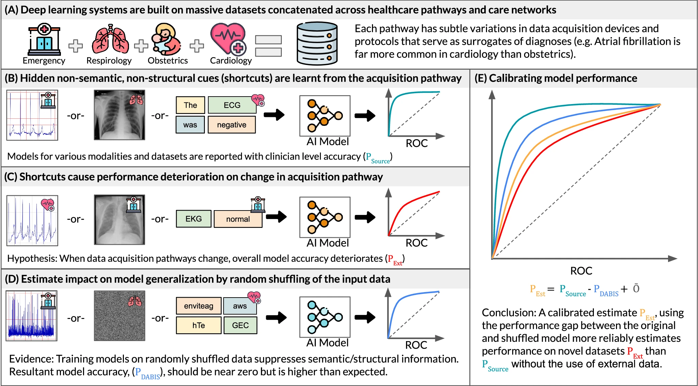

## Shortcut Learning in Medical AI Hinders Generalization: Method for Estimating AI Model Generalization without External Data

The manuscript for this work is presently under review. If you have questions regarding the research in the meantime please find us at https://mcintoshml.github.io/

### Overview


### Quick Start
* This codebase runs using `conda 4.10.3`,`Python 3.8.11`, `PyTorch 1.10.2`, `Torchvision 0.11.3`
* See environment details in `environment.yml`
```bash
conda env create -f environment.yml
conda activate pytorch_venv
```
* Experiments can be run by using the examples provided in `run_expts.sh`
* All data splits are provided in `data/csvs/`

### Adapting the code
* To adapt and use for custom datasets, the example setup provided in `example_code/`
* All global variables can be changed from `constants.py` and the hyperparameters can be changed from within `engine/arg_handler.py` or via command Line.

### Randomization as PyTorch Transform
```python

import numpy as np
import torch

class Randomize(object):
    """Shuffles pixels of given image
    Different shuffle applied for each channel
    """
    def __init__(self, dims,p=1.0,shuffle_channels_independently=False):
        self.dims = dims
        self.p = p
        self.shuffle_channels_independently =  shuffle_channels_independently

    def __call__(self, img):
        if np.random.rand(1)[0] <= self.p:
            shp = img.shape
            idx = np.random.permutation(np.arange(np.prod(shp[1:])))
            for i in list(self.dims):
                if self.shuffle_channels_independently:
                    idx = np.random.permutation(np.arange(np.prod(shp[1:])))
                img[i,...] = img[i,...].view(-1)[idx].view(shp[1:])
        return img
```


